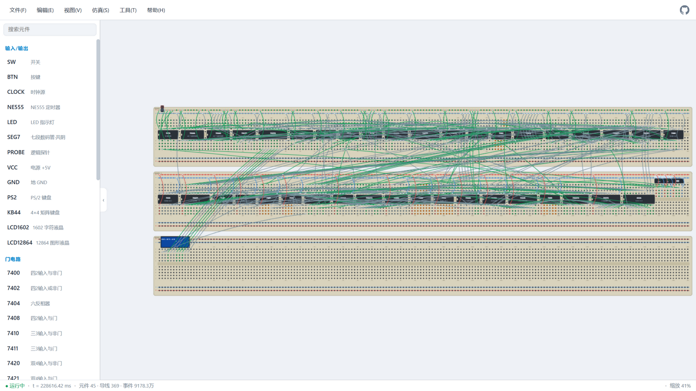

**English** | [简体中文](README.md)

# 74VM — 74-series Digital Circuit Simulator

A pure front-end (zero-dependency) simulator for 74-series logic chip circuits, with **three modes**:

- **📐 Schematic mode**: drag chips, click pins to wire them up, real-time logic-level simulation
- **🍞 Breadboard mode**: realistic breadboard view (60 columns, rows a–j, top & bottom power rails, 5 tied holes per column), **one-click auto-placement from the schematic with all jumper wires generated** (including power jumpers for every chip), per-hole/per-jumper editing (**at most one jumper per hole; holes occupied by chip pins can't take a jumper** — manual wiring enforces the same), **DIP chips only work once connected to the power rails**, circuit keeps simulating in real time
- **🟩 PCB mode**: DIP footprint layout + ratsnest preview, **exports a PCB source file that EasyEDA (Standard edition) opens directly** — pads carry net names, so the ratsnest is there on open and you can run EasyEDA's auto-router right away; also exports a generic netlist JSON (for a future in-house router)



## Run

**Online (GitHub Pages): <https://suulnnka.github.io/74vm/>**

Or run locally:

```bash
cd 74vm
python -m http.server 8111
# open http://localhost:8111 in your browser
```

(Double-clicking `index.html` also works; serving over HTTP is recommended.)

## Features

- **Drag & drop**: drag from the component library on the left or click to place; auto-finds a free, non-overlapping spot
- **Wiring**: click a pin → click the target pin; a pin can take multiple wires (junctions)
- **Real-time level display**: green=1, gray-blue=0, orange=X (floating/conflict), dashed gray=Z (high impedance)
- **Interactive components**: switches, push buttons, clock source (0.1Hz–20kHz), LEDs, 7-segment displays, logic probe, VCC, GND
- **4×4 matrix keypad**: 4 columns (C1..C4) + 4 rows (R1..R4); holding a key connects its row and column; row pins have a built-in pull-down (default, idle 0) / pull-up (idle 1) toggle via right-click; supports both active-high columns and active-low columns (classic 74138/74145 scanning); a pressed column left undriven → rows read X
- **NE555 timer**: real DIP-8 pinout (pin 1 GND / pin 8 VCC, needs power), astable clock output (right-click to change frequency, 0.1Hz–20kHz), ~RST low stops the oscillation (reset), DISCH has true discharge-transistor behavior (conducts while OUT is low, high-Z while high)
- **PS/2 keyboard**: click the component to focus it, then type on your real keyboard; sends the standard PS/2 protocol (Set 2 scan codes) serially on CLK/DATA — Make code on press, Break code (0xF0) on release, 0xE0 prefix for extended keys; frame = start bit + 8 data bits (LSB first) + odd parity + stop bit; the keyboard generates its own ~16.7kHz clock; feed it into a 74164/7474 etc. to build decode circuits
- **1602 character LCD**: HD44780-style interface (RS+E+8-bit data), built-in Chinese font (GB2312 double-byte), monospace rendering; right-click to edit the display text / clear the screen
- **12864 graphic LCD**: ST7920-style, text layer of 4 rows × 16 characters (GB2312 Chinese font) + 128×64-dot graphics layer overlaid; right-click to edit text / clear screen / clear graphics
- **PS/2 test script**: keyboard right-click → edit test script (`type text` / `sleep ms` / `key name`, # comments); running it types automatically on beat — handy for testing
- **Memory (ROM / RAM categories)**: ROM: 74187 ROM 256×4, 74S472 PROM 512×8 (right-click to edit contents, hex paste import / file export), AT28C64B EEPROM 8K×8, AT28C256 EEPROM 32K×8 (real DIP-28 pinout with power on pins 14/28; with /WE=0 it rewrites in-circuit like an SRAM, right-click to edit/export); RAM: 74189 RAM 16×4, 6116 SRAM 2K×8 (active-low /CS /WE /OE, bidirectional data bus, right-click snapshot/export), 6264 SRAM 8K×8 (real DIP-28 pinout, dual chip select — /CS1 active-low + CS2 active-high; floating = not selected, must be tied to VCC)
- **Simulation engine**: event-driven with gate delays; supports feedback loops (latches/ring oscillators self-start), multi-driver conflicts, tri-state, oscillation detection
- **Breadboard mode**: per-hole connectivity model (column groups of 5 + full power rails), ✨auto-routing (generates jumpers net-by-net from the schematic: power nets use the rails as a star-shaped hub, signal nets chain along columns; **at most one jumper per hole — holes taken by chip pins/module legs get no jumper**; power nets automatically route along the rails, **and every DIP automatically gets VCC/GND → rail power jumpers**), power checks (see the rules below), DIPs straddle the center gap on their physical pins, R to flip, unplaced-parts tray; the 1602/12864 LCD modules get a raised screen showing live DDRAM text and GDRAM dots
- **PCB mode**: 2.54mm-grid DIP/pin-header footprints, ratsnest, R to rotate, auto-layout, EasyEDA/netlist export
- **Editing**: select/multi-select, move, rotate, duplicate (Ctrl+D), delete, undo/redo, context menus, right-click to edit labels; switch modes via the toolbar or keys 1/2/3
- **View options**: library panel toggle, breadboard component labels (off = show on hover), **breadboard jumper visibility (off = hidden and non-interactive)**, **level-based coloring (works in all modes; off = monochrome pins/wires/holes/jumpers; rail red/blue polarity colors are kept)**; settings persist
- **Component descriptions**: two fields per component — a short summary (one-line function, shown in the sidebar/canvas/place hints) and a full description (function + pin I/O notes); hover over a component briefly for a tooltip (follows the mouse, disappears on leave), or right-click → View description for a dialog
- **Persistence**: changes auto-save (including breadboard jumpers and the PCB layout); JSON export/import; 17 built-in examples

## Supported components (real DIP pin numbers, power pins omitted)

| Category | Components |
|---|---|
| Gates | 7400 7402 7404 7408 7410 7411 7420 7421 7432 7486 |
| Combinational logic | 7448 (BCD→7-segment) 74138 74139 74151 74153 74157 74283 (adder) 7485 (comparator) |
| Flip-flops / latches | 7474 (D) 7476 (JK) 74175 (quad D) 74374 (octal D · tri-state) |
| Counters / shifters | 74161 (4-bit counter) 74164 (shift register) 74595 (shift/latch · tri-state) |
| Bus interface | 74245 (octal transceiver · tri-state) |
| ROM | 74187 (ROM 256×4) 74S472 (PROM 512×8) AT28C64B (EEPROM 8K×8) AT28C256 (EEPROM 32K×8) |
| RAM | 74189 (RAM 16×4) 6116 (SRAM 2K×8) 6264 (SRAM 8K×8 · dual chip select) |
| Input / output | Switch Push button Clock source NE555 (timer·clock) LED 7-segment display Logic probe PS/2 keyboard 4×4 matrix keypad VCC GND LCD1602 (character) LCD12864 (graphic) |

## EasyEDA export notes

PCB mode → **📤 Export EasyEDA** generates `74vm-pcb-easyeda.json` (EasyEDA Standard source-file format, docType=3, mil coordinates). In EasyEDA Standard: **File → Import → EasyEDA** (or just open the JSON) → you get a PCB with nets: pads carry VCC/N1… net names, silkscreen outlines and a board outline, the editor shows the ratsnest, and you can then use EasyEDA's **auto-router**. The Pro edition can import the Standard file first and convert.

Known limitations: components export as loose pads + silkscreen (not grouped footprints); reference-designator texts must be added inside the EDA; make sure every component has been placed before exporting.

## Simulation rules

- Unconnected inputs are treated as **X** (orange) and propagate through gates
- Active-low pins (names with `~`: ~CLR, ~OE, ~G2A etc.) reading X are treated as "not asserted" (weak pull-up)
- Multiple outputs on the same net with conflicting levels → **X**; no driver → **Z**
- On wiring/power-up the engine applies a one-shot "power-on perturbation" to gates whose output is X, so pure feedback loops can self-start
- Breadboard mode: hole connectivity (column groups / power rails / jumpers) derives a netlist, guaranteed strictly equivalent to the schematic netlist (covered by tests)
- **Breadboard power check**: the column of a DIP chip's VCC pin (physical max pin, e.g. pin 14 on a 14-pin chip) and GND pin (physical middle pin, e.g. pin 7) must be jumpered to the power rails — VCC column → red rail (+), GND column → blue rail (−); otherwise the chip counts as unpowered: all outputs forced to X, an "unpowered" badge on the chip, and the count shown in the status bar; the NE555 is powered on its real pins (lib.pwr override: pin 1 GND / pin 8 VCC); **AT28C64B/AT28C256/6264 are real DIP-28 memories** (lib.pwr: pin 14 GND / pin 28 VCC) and take part in the power check and auto power jumpers like any other DIP; **idealized memory models** (74S472/6116/74187/74189, compressed pin numbering without power pins) count as always powered and skip both the power check and the power jumpers; **active virtual components** (clock source, PS/2 keyboard) carry implicit VCC/GND power legs on both sides of their signal pins (one extra column wide) and also need power — unpowered, the clock stops oscillating and the PS/2 keyboard sends nothing; the power rails count as connected to a bench supply, and once powered, connected holes/jumpers show red/blue by polarity (+ and − touching shows orange); ✨auto-routing generates the power jumpers automatically and keeps power columns from being occupied by signal jumpers; passive components (switch/push button/LED/7-segment/probe/VCC/GND) and schematic mode have no power check and get no power jumpers either
- **Breadboard wiring rules**: one jumper per hole (chip pins count as occupied); jumpers only go into free holes and connect to chip pins in the same column group through the metal clip — auto-routing follows these rules (power nets star onto the rails, signal nets chain along columns), the UI enforces them for manual wiring/moving too, and component placement avoids holes already holding a jumper

## Built-in examples

17 classic circuits, all verified automatically in all three modes (`node test/test-examples.js`: schematic truth tables/timing, breadboard auto-placement fits + power verdict + netlist equivalence + derived-netlist re-check, PCB auto-layout stays on board):

| # | Example | Highlights |
|---|---|---|
| 1 | SR latch (7400) | Cross-coupled NAND feedback; a switch outputting 0 triggers it; both 0 is the forbidden state |
| 2 | D flip-flop divide-by-2 (7474) | D tied to ~Q, toggles on every edge |
| 3 | Half adder (7486+7408) | S=A⊕B, C=A·B, full truth table |
| 4 | 4-bit full adder (74283) | Datasheet bit names A4~A1/B4~B1, with C0/C4 carries |
| 5 | 3-to-8 decoder (74138) | Address switches pick the route, active-low outputs |
| 6 | 8-to-1 multiplexer (74151) | D0~D3=1 / D4~D7=0, Y and ~Y complementary |
| 7 | JK flip-flop toggle (7476) | J=K=1 toggles, divide-by-2 |
| 8 | 4-bit counter (74161) | 0–15 loop, LEDs show the binary value |
| 9 | 7-segment counter (74161+7448) | count → BCD decode → 7-segment display |
| 10 | 8-bit shift/latch (74595) | clock bits in, button latches them to the outputs |
| 11 | Ring oscillator (7404) | three-inverter ring self-oscillates on gate delay |
| 12 | Tri-state bus (74245) | DIR direction / ~OE high-Z |
| 13 | NE555 blinker | astable square wave, TRIG/THRES/DISCH tied together |
| 14 | PS/2 scan-code receiver (74164) | keyboard frame bits shift in serially, watch on an LED |
| 15 | Keypad scanning (74138+7404) | column-by-column scan; holding a key lights the row LED |
| 16 | 1602 LCD typewriter | toggle RS/D7~D0 + E buttons to hand-write instructions/characters |
| 17 | VM-8 CPU clock computer | 8-bit microcoded CPU + 1602 clock display + PS/2 time setting + 1Hz real-time clock; a 248-byte clock program is burned into ROM (built-in assembler, editable); covered by `test/test-cpu.js` with 77 deep tests (microcode/assembler/instruction-level/keyboard capture/keeping-time integration/three modes) |

## File structure

```
index.html        page skeleton + three-mode toolbar
css/style.css     dark theme styles
js/engine.js      event-driven simulation engine (net merging, event heap, clock scheduling, serialization)
js/chips.js       component library (pin definitions + per-chip simulation logic)
js/breadboard.js  breadboard model (holes/connectivity/auto-place/auto-wire)
js/pcb.js         PCB model (footprints/pads/ratsnest/auto-layout)
js/easyeda.js     EasyEDA PCB source-file + generic netlist export
js/examples.js    built-in example circuits
js/i18n.js        i18n support (Chinese is the source language; initial language follows the browser locale: non-Chinese → English)
js/i18n-en.js     English dictionary + help text
js/app.js         rendering & interaction (three-mode views, drag/wire/jumper, undo, persistence)
test/test-engine.js  engine tests (63 items)
test/test-modes.js   mode tests (129 items: netlist equivalence/physical pin mapping/memory/power check/export formats)
test/test-cpu.js     VM-8 CPU deep tests (77 items: microcode/assembler/instruction-level/keyboard capture/full integration/three modes)
test/test-i18n.js    i18n tests (14 items: initial-language detection)
```

## Tests

```bash
node test/test-engine.js   # gate logic/latches/counters/adders/7-segment/tri-state/oscillator/serialization
node test/test-examples.js # all 17 built-in examples verified in three modes
node test/test-modes.js    # breadboard netlist equivalence (17 examples)/PCB footprints/EasyEDA export format
node test/test-cpu.js      # VM-8 CPU: microcode/assembler/instruction-level/keyboard/clock program/three modes
node test/test-i18n.js     # i18n: initial-language detection (saved choice first, else browser locale)
```
